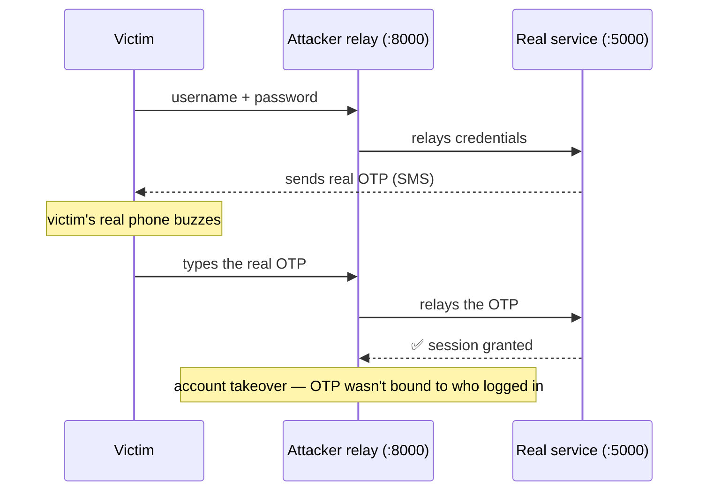
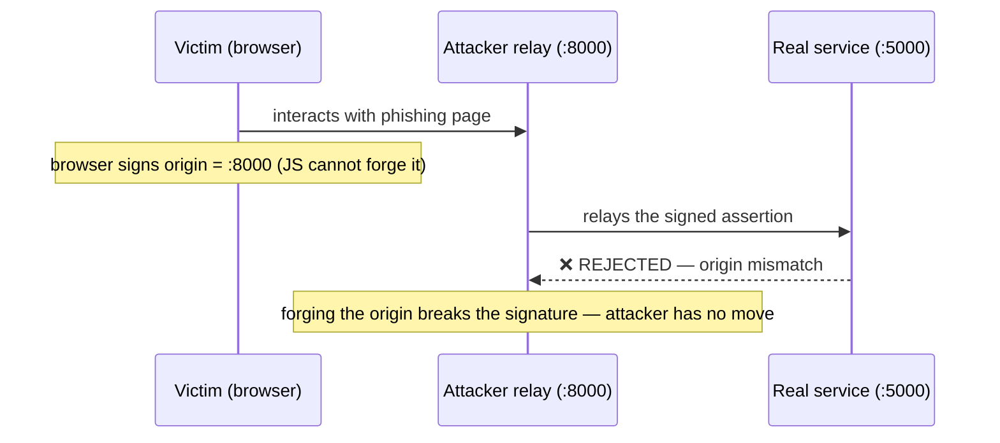
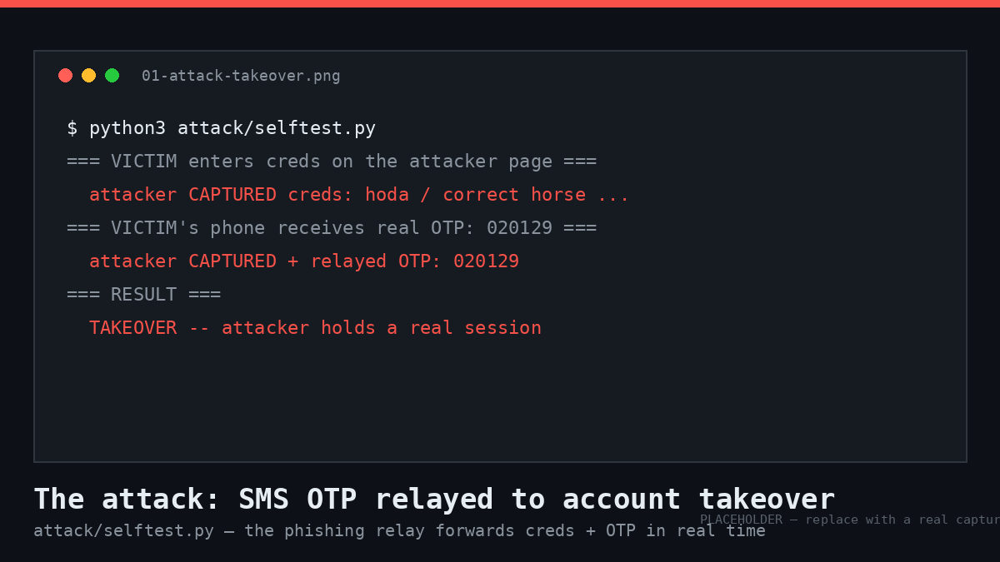
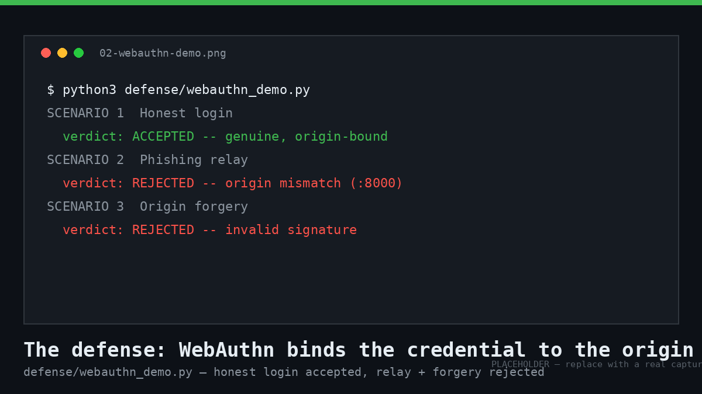
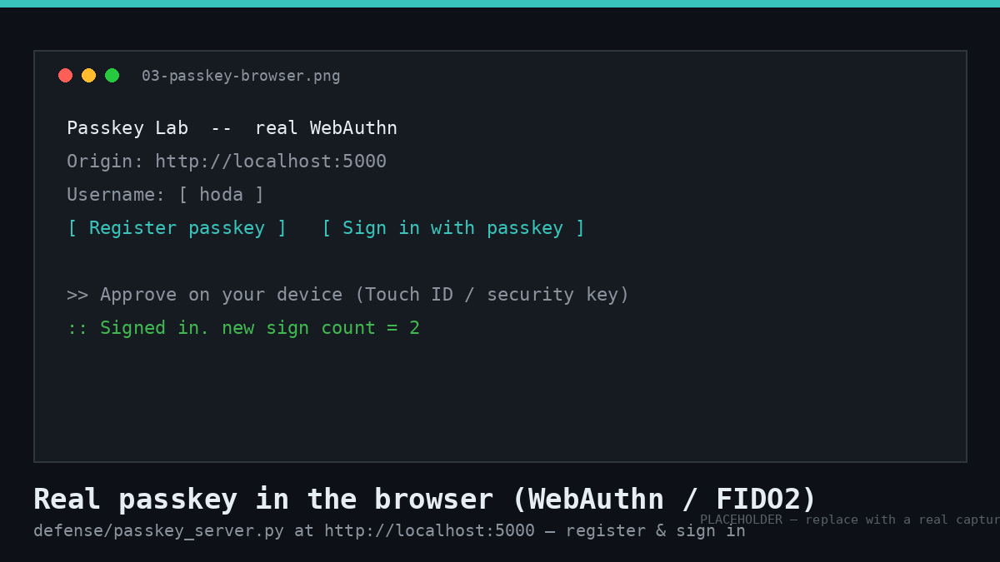

# 🔐 Smishing-Resistance Lab

> A hands-on lab that **demonstrates why SMS one-time passwords fall to real-time phishing — and proves, with real cryptography, why passkeys (WebAuthn/FIDO2) don't.**


Most people believe "if an account has 2FA, a phished password is useless."
This lab shows that's **false for SMS/TOTP** and **true for passkeys** — by
building the attack, running it to a successful account takeover, then standing
up the defense that shuts it down. Every component runs on `localhost` against
test accounts you create yourself.

---

## 🎯 What this project demonstrates

| Skill area | Shown by |
|------------|----------|
| **Attacker tradecraft** — real-time credential/OTP relay (adversary-in-the-middle) | `attack/` |
| **Applied cryptography** — ECDSA P-256, signature verification, origin binding | `defense/webauthn_core.py` |
| **Protocol depth** — WebAuthn/FIDO2 ceremony end to end (registration + authentication) | `defense/passkey_server.py` |
| **Secure web development** — Flask services, session challenges, `py_webauthn` | throughout |
| **Defensive reasoning** — mapping each mitigation to the exact attack step it breaks | [`docs/comparison.md`](docs/comparison.md) |
| **Security ethics & scope discipline** | [Ethics & scope](#-ethics--scope) |

---

## 🗺️ How it works

### The attack — SMS OTP is *relayable*



### The defense — a passkey is bound to the origin



---

## 📦 Project structure

```
smishing-resistance-lab/
├── attack/                     # The offense: why SMS OTP falls
│   ├── real_service.py         #   legitimate "SecureBank" (issues OTP)
│   ├── phishing_relay.py       #   adversary-in-the-middle relay
│   └── selftest.py             #   automated end-to-end proof of takeover
├── defense/                    # The defense: why passkeys hold
│   ├── webauthn_core.py        #   RP-side verification (7 checks, real ECDSA)
│   ├── soft_authenticator.py   #   simulated FIDO2 authenticator + browser glue
│   ├── webauthn_demo.py        #   3 scenarios: honest / relayed / forged
│   └── passkey_server.py       #   REAL browser passkey via navigator.credentials
├── docs/
│   └── comparison.md           # SMS vs TOTP vs push vs passkey
├── requirements.txt
├── LICENSE
└── README.md
```

---

## 🚀 Quick start

```bash
git clone https://github.com/yehiasamir27/smishing-resistance-lab.git
cd smishing-resistance-lab
python3 -m venv .venv
.venv/bin/pip install -r requirements.txt
```

Run everything below with the venv's Python: `.venv/bin/python <script>`
(or `source .venv/bin/activate` once, then just `python`).

### 1️⃣ See the attack succeed (SMS OTP takeover)

Two terminals:

```bash
# Terminal A — the legitimate service (prints the "SMS" OTP)
.venv/bin/python attack/real_service.py

# Terminal B — the attacker relay
.venv/bin/python attack/phishing_relay.py
```

Then browse to **http://127.0.0.1:8000**, log in as `hoda` /
`correct horse battery staple`, read the OTP from Terminal A, enter it, and
watch Terminal B complete the takeover.

Prefer a one-command proof? `.venv/bin/python attack/selftest.py`

```
=== VICTIM enters creds on the attacker page; attacker relays them ===
  attacker CAPTURED creds: hoda / correct horse battery staple
=== VICTIM's phone receives real OTP: 020129 (attacker will relay it) ===
  attacker CAPTURED + relayed OTP: 020129
=== RESULT ===
  TAKEOVER -- attacker holds a real session
```



### 2️⃣ See the defense (simulated, real crypto)

```bash
.venv/bin/python defense/webauthn_demo.py
```

```
SCENARIO 1: Honest login  ->  ACCEPTED — assertion is genuine and origin-bound
SCENARIO 2: Phishing relay -> REJECTED — origin mismatch: signed for :8000, RP accepts :5000
SCENARIO 3: Origin forgery -> REJECTED — invalid signature (data was tampered)
```



### 3️⃣ Try a real passkey (your own device)

```bash
.venv/bin/python defense/passkey_server.py
```

Open **http://localhost:5000** — use `localhost`, **not** `127.0.0.1` (the RP ID
is `localhost`; browsers treat it as a secure context, so no HTTPS is needed).
Register with Touch ID / Windows Hello / a security key, then sign in.



> 📸 The three images above are labeled placeholders — see
> [`assets/README.md`](assets/README.md) to swap in your own screenshots
> (same filenames, no README edits needed).

> ⚠️ `real_service.py` and `passkey_server.py` both use port 5000 — run them one
> at a time.

---

## 🧠 The takeaway

| | SMS / TOTP | Passkey (WebAuthn) |
|---|---|---|
| Secret is… | a code the user types | a signature bound to the origin |
| Can a live relay forward it? | **Yes** | **No** |
| Protected by… | user vigilance | cryptography + the browser |

A code is portable, so it can be relayed. A passkey signs the *origin* of the
page the browser is really on — the attacker can neither present the true origin
(rejected) nor forge it (breaks the signature). That is what "phishing-resistant"
actually means, and why passkeys are replacing SMS 2FA.

📖 **Full narrative walkthrough:** [`docs/writeup.md`](docs/writeup.md) — the
story of building the attack and the defense, written for a general technical
reader.
📊 **Factor-by-factor comparison:** [`docs/comparison.md`](docs/comparison.md).

---

## 🛡️ Ethics & scope

This lab is for **education and authorized testing only**.

- Everything runs on `localhost`. The "victim," the account, and the "SMS" are
  all local and belong to you.
- It teaches the **mechanism and its defenses** — the goal is to build systems
  that resist this attack.
- Pointing a relay like this at a real service or real users is account-takeover
  fraud and is illegal. Keep it on `localhost`.

---

## 📚 References

- [W3C WebAuthn Level 3](https://www.w3.org/TR/webauthn-3/)
- [FIDO Alliance — Passkeys](https://fidoalliance.org/passkeys/)
- [py_webauthn](https://github.com/duo-labs/py_webauthn)
- [OWASP — Credential Stuffing / MFA guidance](https://owasp.org/www-community/)

## 📄 License

MIT — see [LICENSE](LICENSE).
